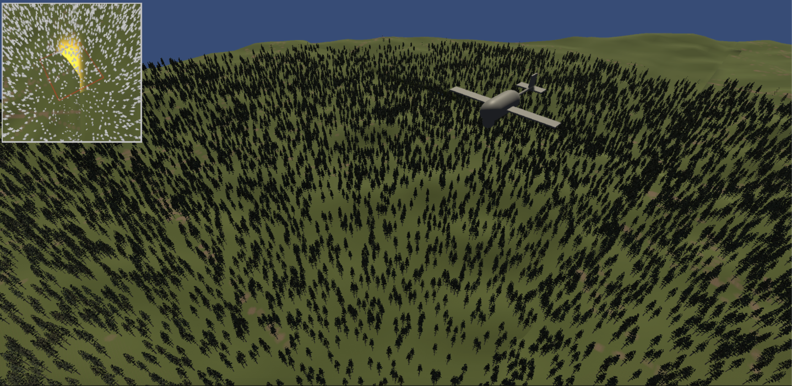
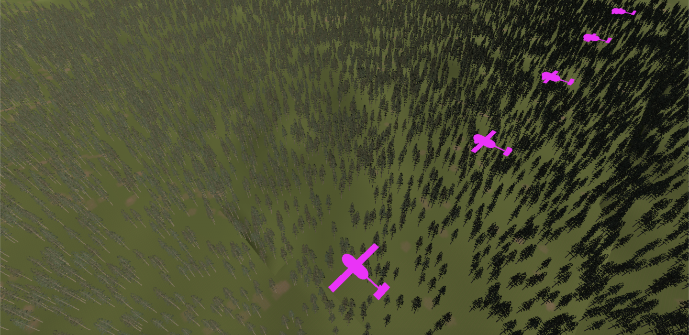

  

## Feu de forêt (Détecteur) :

Le projet consiste en un drone pour la surveillance des forêts. Les objectifs du drone sont la reconnaissance, l'identification de départ de feu. Ce drone
peut travailler en essaim pour augmenter la zone de couverture et la robustesse du système.

Pour présenter notre projet nous avons réalisé une cinématique pour mettre en évidence les différents aspects du drone et son apport réel sur le terrain.

# Mise en oeuvre :

Le dépot comporte le dossier Assets qui est à importé dans un projet Unity. Pour exécuter le projet, il faut se placer sur la scène clip1 et lancer la scene.
Le projet a été développé sur la version 2021.14f.

# Autres informations :

La plupart de nos assets sont des Prefabs qu'on a réutilisé plusieurs fois dans notre scène. On a plusieurs scripts qu'on applique sur nos assets. Comme Go_Forward, qui permet au drone de se déplacer ou encore TimeLine, où toute la simulation est codée.